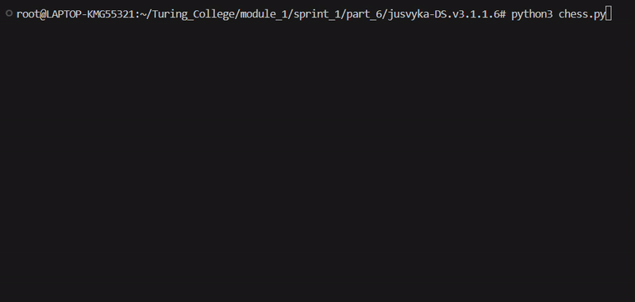

# Chess Capture Analysis Tool by jusvyka TC DS M1S1

## Overview

**Chess Capture Analysis Tool** is a Python-based project designed to analyze chess positions and determine which black pieces a single white piece can capture. The program evaluates the positions of one white piece and up to 16 black pieces and outputs black pieces that are "at risk" of being captured. This project is submitted for reviews as part of Turing College Data Science program.

## Features
- Input the positions of a single white piece and multiple black pieces.
- Output the list of capturable black pieces by white.
- Program can be exited by writting "quit" or using ctrl+d.

## Contents
In this repository you can find:
- chess.py
- tests/

chess.py is the main program.
tests/ is folder in which my custom tests can be found to test the program. All of the tests can be run using pytest package.

## Requirements
Have at least python 3 installed in chosen enviroment.

## Usage
1. Clone this repository:
   ```bash
   git clone https://github.com/TuringCollegeSubmissions/jusvyka-DS.v3.1.1.6.git
   ```
2. Navigate to the project directory:
   ```bash
   cd jusvyka-DS.v3.1.1.6/
   ```
3. Run the script:
   ```bash
   python chess.py
   ```

### Usage Example



## Supported Pieces
- **White Pieces**: Rook, Knight
- **Black Pieces**: Up to 16 pieces, from one chess set i.e. 2 kings can't be inputted.


## Acknowledgments
Special thanks Povilas Trainavičius for reviewing and giving great advice for this project and journey in Turing College overall.

